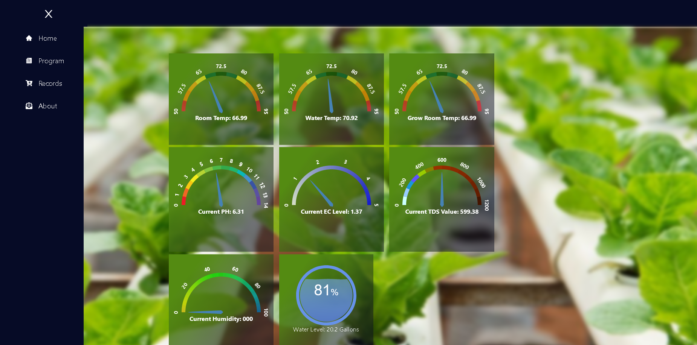
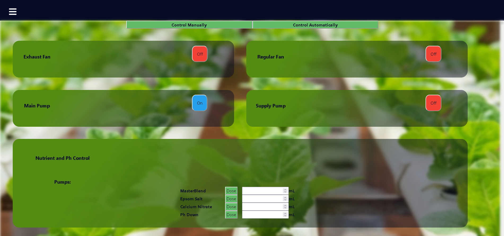
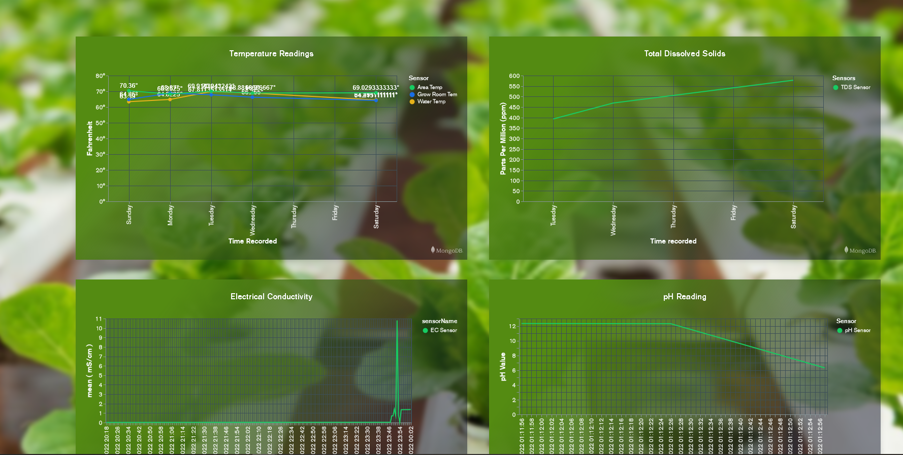
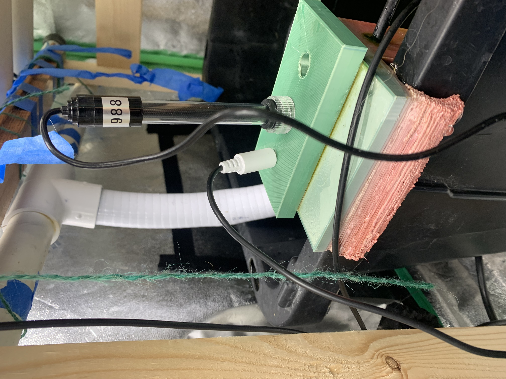
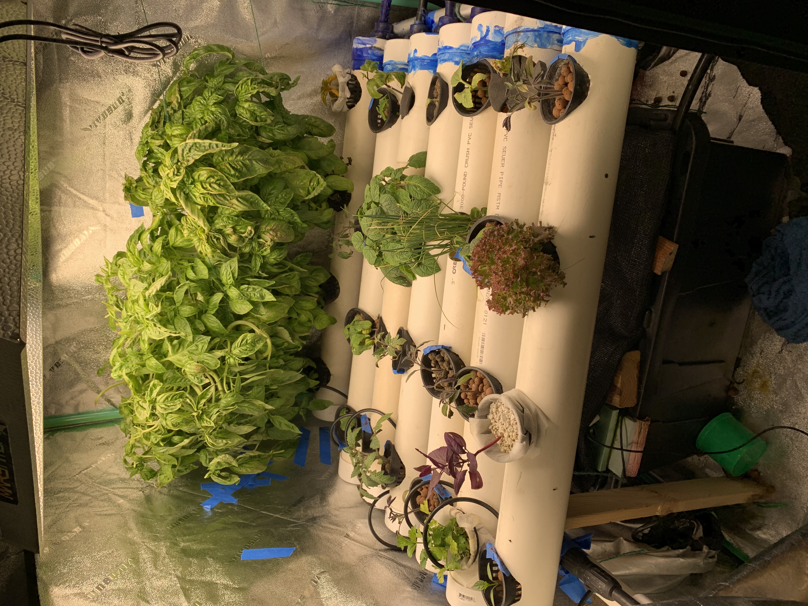

# Hydroponic Monitoring and Control System

## Introduction 

A big hobby of mine that I have recently gotten into is hydroponics, growing plants in a soilless medium, in my particular case I’m growing plants directly in water. </br>

Hydroponics offers both the home gardener and large scale farmer numerous benefits when compared to growing crops/plants using traditional methods.
The biggest benefits seen in using hydroponics over traditional methods are the following:</br></br>
    - Uses up to 98% less water</br>
    - When combined with vertcial farming techniques can use up to 99% less space to grow plants</br>
    - Plants can grow over 50% faster</br>
    - Drastically increases overall output</br>
    - Requires no soil</br>
    - Can be done anywhere</br>
    - Requires less labor</br>
    - Produces healthier plants and higher quality food</br>
    - Doesn't rely on seasons</br>
    </br>
 ### Problem Statement

With hydroponics there is a lot of monitoring and user interaction that is required to successfully grow plants.</br> Things like measuring pH, water temperature, room temperature, electrical conductivity (EC) of the water (nutrient concentration) , humidity and a lot more. All of which as of now have to be measured and adjusted by hand. </br> This takes time out of one's day to do and requires the individual in charge of the hydroponic system to always have to be within the area in order to make changes when needed. </br> Not to mention through human interaction we introduce a high potential for errors to occur. This can potentially cause devistating effects on the plants which can offen be unreversable.

### Solution

The solution to this problem is to create a live monitoring and control system that will allow the gardener to make adjustments to the system from anywhere on the planet.


### Tech Overview
There are four main components to this application, there's the Device Controller that directly interacts with both the sensors and the controllable devices (pumps, fans, etc.). This portion of the project was written purely in Python though all device/sensor code is written in C++ and uploaded using the Arduino IDE. The main file that does all the driving for this part of the project is the ```arduino-device-client.py``` file. This file is responsible for reaching out to the sensors/devices using a REST API. This program also searches for new devices that connect to the network using MDNS and adds their IP address to a list so that we can connect and stream data from the device/sensor.

Then there's the devices/sensors themselves which like mentioned previously are all written in C++ as they are Arduino based devices. Specifically they are ESP32's and each one is setup with the same basic webserver setup, with the only differences being the code that communicates with the actual sensor such as a pH sensor or a temperature sensor.

To add on to that a temporary solution for turning devices on and off is using Govee Wifi Outlets that are connected to the HomeBridge application and can be toggled on and off using HomeBridge's REST API.

The next big part of this application is the Socket.io server thats hosted on an express server using NodeJs. This server is responsible for communicating and sending data/commands between the python application and the frontend UI portion of this project.

Lastly there's of course the frontend UI, this was built using the React Framework so that I could build a good looking site with relative ease, but most importantly I wanted the ability to make and reuse components as I see fit which React does a great job of.

The UI currently consists of a home page that displays all the latest/live values of the sensors that are connected to the system. There's also a program page that currently only allows users to manually control devices. On top of that there is a Records page that shows charts of the data being collected and how it changes over time. 

### Data Storage
Currently data is stored in a simple MongoDB instance without any form of authentication. It stored under a Database instance called Devices where each device has an associated table in which the data is stored. The scheme for the data entries is pretty straightforward, they contain a unique ID, a UserID thats associated with the current user (for now its just hardcoded as mine), a device name, then the type of reading (ppm, mS/c,, pH, etc.) followed by the actual value of the reading, and the time stamp of when it was recorded.

### Running the program
To run the program there's two options:

If Docker is installed simply run ```docker-compose build``` followed by ```docker-compose up``` and then open up the webpage to view the live data by going to localhost:5500 in the browser.

Alternatively if Docker is not installed navigate into the Device_client folder and run the following to get the required packages ```pip install -r requirements.txt```.
Then to run this part of the program simply run ```python arduino-device-client.py ```. The python program from this point will be trying to connect to the Socket.io server

For the Socket.io server navigate into the ```webserver``` folder and first run ```npm install``` to install all the needed packages and then run ```node ./index.js``` to start up the Socket.io server.

Lastly, navigate into the web-frontend folder and once again install the needed packages by running ```npm install``` followed by ```npm start``` to actually run the application. 

At this point all the clients should be connected to the server and if any devices are connected then the live data will be displayed in the UI. If no data is received then the UI will simply display the most recently added data entry for that particular sensor. So even if you have no devices connected there should be data shown. (With the exception of the Humidity sensor as that has yet to be configured in the backend.)

### Screenshots







### Sensors 



### Garden


